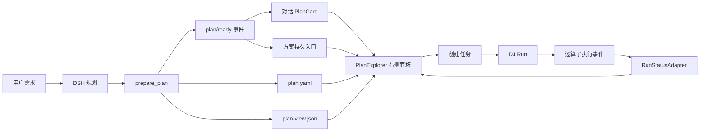

# DSH × Data-Juicer 方案编排展示与运行状态关联方案

## 1. 文档状态

- 状态：方案设计
- 适用版本：`@deepseek-ai/dsh 0.1.1-rc.2`、当前 Data-Juicer Plan Flow
- 第一版范围：线性流程、只读展示、创建任务前预览、创建任务后复用并显示逐算子状态
- 不在第一版范围：可视化拖拽编辑、DAG/条件分支、从任意节点重试、中间数据预览

## 2. 背景

DSH 可以根据用户需求调用 Data-Juicer（下称 DJ）规划工具，生成包含 `recipe.process` 的 Plan。DJ Plan 中的执行步骤是一个平铺、有序的算子列表，适合校验和执行，但不适合直接向用户解释一个较长的数据处理方案。

目标是在 DSH 对话中提供一套与真实 DJ Plan 严格关联的方案展示：

1. DSH 完成规划后，在对话中生成可持久化的方案卡片；
2. 用户点击方案卡片后，在对话右侧打开约半屏宽度的方案面板；
3. 面板支持调整宽度、最大化、恢复和关闭；
4. “轨迹”右侧提供持久化的“方案”入口，用户无需回滚聊天记录寻找原卡片；
5. 长流程可以按任务语义折叠为阶段，展开后显示真实 DJ 算子；
6. 点击节点可以查看对应的 recipe 配置、Plan 和自定义算子源码；
7. 点击“创建任务”后复用同一张图，并把 DJ 执行事件映射到每个算子节点。

## 3. 已确认决策

| 主题 | 决策 |
| --- | --- |
| 首次展示时机 | DSH 给出方案后、点击“创建任务”之前 |
| 创建后行为 | 继续复用同一个方案面板和节点图 |
| 流程形态 | 第一版只支持线性流程 |
| 编辑方式 | 第一版只读；修改通过“让 DSH 调整方案”产生新 Plan 版本 |
| 展示分组 | 由 DSH 在规划时明确给出，不由前端根据算子名称猜测 |
| DJ recipe | 保持 DJ 原生结构，不向 `recipe.process` 注入展示节点 |
| 分组存储 | 与 Plan 同版本保存为旁路文件 `plan-view.json` |
| 节点详情 | 默认展示 recipe 片段；完整 Plan 独立查看；自定义算子才展示 Python 源码 |
| 运行状态 | 每个真实 `recipe.process` 算子节点均显示状态、耗时、数据量和错误摘要 |
| 入口 | 对话内 PlanCard + “轨迹”右侧持久化“方案”入口 |
| 右侧区域 | 算子库和方案面板按点击入口互斥切换，不同时显示 |

## 4. 设计原则

### 4.1 执行事实与展示解释分离

`plan.yaml` 是 DJ 的执行事实；`plan-view.json` 是同一 Plan 版本的展示解释。展示分组不能改变算子参数、执行顺序或执行结果。

### 4.2 子节点必须对应真实执行步骤

需要独立状态的子节点必须对应一个真实的 `recipe.process[index]`。仅用于说明的内容不能伪装成可执行节点，否则创建任务后无法准确显示状态。

### 4.3 不从助手 Markdown 反向解析

PlanCard、展示分组、版本和运行映射都必须来自结构化数据或持久化事件，不能从助手回复里的编号、表格或自然语言中解析。

### 4.4 Plan 版本不可变

用户要求调整方案时，DSH 生成新的 Plan 版本及其 `plan-view.json`。旧卡片、旧 Plan 和旧 Run 继续指向原版本。

## 5. 总体架构



模块职责如下：

| 模块 | 职责 |
| --- | --- |
| PlanPresentation | 校验展示分组、生成稳定节点标识、保存并加载 `plan-view.json` |
| PlanEventProjection | 将 `plan/ready` 等事件投影为对话中的 PlanCard 和会话 Plan 列表 |
| AuxiliaryPanelHost | 在同一个右侧区域内切换算子库或 PlanExplorer |
| PlanExplorer | 渲染线性阶段图、节点详情、完整 Plan 和运行状态 |
| RunStatusAdapter | 把 DJ 的 `op_idx + op_name` 事件规范化成前端步骤状态 |

## 6. 用户交互

### 6.1 创建任务前

```text
DSH 完成 Plan 校验
  → 对话中出现 PlanCard
  → 顶部“方案”入口出现
  → 点击卡片“展示”或顶部“方案”
  → 右侧打开 PlanExplorer
  → 用户审查编排、参数和完整 Plan
  → 点击“创建任务”或“让 DSH 调整方案”
```

PlanCard 建议包含：

- 方案名称；
- `plan_version`；
- 校验状态；
- 阶段数和执行步骤数；
- 简短说明；
- “展示”“创建任务”操作。

### 6.2 创建任务后

创建任务后不替换或重建节点图，而是给原 PlanExplorer 绑定 `run_id`：

```text
待创建 → 已创建 → 运行中 → 成功 / 失败 / 已取消
```

用户关闭右侧面板后，“方案”入口仍存在。再次点击时恢复当前会话最新 Plan，以及上次选中的节点和查看方式。

### 6.3 调整方案

第一版不允许在画布上拖动或修改节点。用户点击“让 DSH 调整方案”后，通过对话描述修改要求：

```text
plan_v001 + 用户调整要求
  → DSH 重新规划和校验
  → plan_v002 + plan-view.json
  → 新 PlanCard
```

顶部“方案”入口默认打开最新版本；面板内提供版本选择，历史 Run 始终绑定其原 Plan 版本。

## 7. DJ Plan 与展示数据

### 7.1 DJ Plan 保持原生结构

```yaml
plan_id: task_xxx/plan_v001
user_intent: 清洗 WARC 文本用于模型训练
modality: text
recipe:
  dataset_path: input.jsonl
  export_path: output.jsonl
  process:
    - clean_html_mapper: {}
    - remove_copyright_mapper: {}
    - language_id_mapper: {}
    - chinese_convert_mapper:
        target: simplified
    - whitespace_normalizer: {}
```

展示分组不写入 `recipe.process`，因此不会影响 DJ 的 schema 校验、内容语义和执行顺序。

### 7.2 DSH 提交展示分组

建议给 `prepare_plan` 增加可选的 `view_spec` 参数：

```json
{
  "plan": {
    "user_intent": "清洗 WARC 文本用于模型训练",
    "recipe": {
      "process": [
        {"clean_html_mapper": {}},
        {"remove_copyright_mapper": {}},
        {"language_id_mapper": {}},
        {"chinese_convert_mapper": {"target": "simplified"}},
        {"whitespace_normalizer": {}}
      ]
    }
  },
  "view_spec": {
    "groups": [
      {
        "title": "基础文本清洗",
        "summary": "移除网页结构和常见声明内容",
        "process_indexes": [0, 1]
      },
      {
        "title": "语言识别与规范化",
        "summary": "识别语种并执行相应的文本规范化",
        "process_indexes": [2, 3, 4]
      }
    ]
  }
}
```

DSH 只负责语义命名和成员选择；后端负责生成 ID、映射执行键、校验并持久化。

### 7.3 `plan-view.json`

```json
{
  "schema_version": "1.0",
  "plan_id": "task_xxx/plan_v001",
  "plan_version": "plan_v001",
  "recipe_content_hash": "sha256:...",
  "layout": "linear",
  "groups": [
    {
      "id": "stage-001",
      "title": "基础文本清洗",
      "summary": "移除网页结构和常见声明内容",
      "step_refs": ["step-000", "step-001"]
    },
    {
      "id": "stage-002",
      "title": "语言识别与规范化",
      "summary": "识别语种并执行相应的文本规范化",
      "step_refs": ["step-002", "step-003", "step-004"]
    }
  ],
  "steps": [
    {
      "id": "step-000",
      "process_index": 0,
      "operator_name": "clean_html_mapper",
      "execution_key": "op_001_clean_html_mapper",
      "implementation": {
        "kind": "catalog_operator"
      }
    },
    {
      "id": "step-003",
      "process_index": 3,
      "operator_name": "chinese_convert_mapper",
      "execution_key": "op_004_chinese_convert_mapper",
      "implementation": {
        "kind": "catalog_operator"
      }
    }
  ]
}
```

### 7.4 校验规则

PlanPresentation 必须执行以下校验：

1. `process_index` 必须存在；
2. 一个执行步骤最多属于一个阶段；
3. 组内步骤必须保持 recipe 原始顺序；
4. 分组不能改变整个流程的执行顺序；
5. 未被分组的步骤自动生成独立阶段；
6. `recipe_content_hash` 必须与当前 Plan 版本匹配；
7. `operator_name` 必须与对应 `recipe.process[index]` 一致；
8. DSH 未提供 `view_spec` 时，降级为“一个算子一个阶段”。

## 8. PlanCard 与持久化入口

### 8.1 DSH 当前能力判断

当前 DSH 安装中存在对话事件、`conversation.chat.node`、`conversation.view` 和图片附件展示扩展，但没有发现可直接复用的语义化“方案卡片”。因此应新增 Plan 专用事件和投影，而不是将 PlanCard 当作普通图片附件或从 Markdown 中解析。

### 8.2 `plan/ready` 事件

`prepare_plan` 成功并保存展示文件后，向当前会话写入持久化事件：

```json
{
  "type": "plan/ready",
  "data": {
    "plan_id": "task_xxx/plan_v001",
    "plan_version": "plan_v001",
    "title": "WARC 文本提取与清洗方案",
    "summary": "提取正文、识别语言、规范化并过滤低质量文本",
    "valid": true,
    "stage_count": 5,
    "step_count": 11,
    "content_hash": "sha256:...",
    "created_at": "2026-08-31T00:00:00Z"
  }
}
```

对话投影使用该事件生成 PlanCard。刷新、恢复会话或读取历史时，卡片仍可重新构建。

### 8.3 “方案”持久入口

在“对话/轨迹”页签条的尾部增加启动器插槽：

```text
conversation.session.tabs.trailing
```

Plan 插件在会话存在至少一个 Plan 时注册“方案”按钮：

- 无 Plan：隐藏；
- 有 Plan：显示；
- 点击：调用 `openPlan(latestPlanRef)`；
- PlanExplorer 正在打开：显示活动状态；
- 多版本：默认打开最新版本，版本选择放在面板内部。

该入口位于页签条中，但不是普通 `conversation.view`。普通 view 会替换中间对话内容，而本入口只负责打开右侧面板。

## 9. 右侧辅助面板

### 9.1 交互行为

- 默认宽度：可用工作区的 50%；
- 最小宽度：560px；
- 默认最大停靠宽度：960px；
- 支持拖拽调整宽度；
- 支持最大化，占据除左侧导航外的全部工作区；
- 支持恢复停靠；
- 支持关闭；
- 关闭不清除当前页面、Plan 版本、选中节点和画布状态。

### 9.2 与算子库的关系

产品交互上不存在冲突：算子库和方案面板由不同入口打开，同一时刻只显示一个。

当前 `shell.auxiliary` 是单实例插槽，算子库直接占用该插槽。为支持按入口切换，应引入一个很薄的 `AuxiliaryPanelHost`，而不是让两个插件分别注册同一单实例插槽：

```ts
type AuxiliaryPage =
  | { kind: "operator-library" }
  | { kind: "plan"; planRef: PlanRef }
  | null;
```

```ts
openOperatorLibrary();
openPlan(planRef);
closeAuxiliary();
toggleAuxiliaryMaximized();
```

```tsx
function AuxiliaryPanelHost() {
  const page = useAuxiliaryPage();

  if (page?.kind === "operator-library") {
    return <OperatorLibrary />;
  }

  if (page?.kind === "plan") {
    return <PlanExplorer planRef={page.planRef} />;
  }

  return null;
}
```

点击算子库入口会切换到算子库；点击 PlanCard 或“方案”入口会切换到 PlanExplorer。

## 10. PlanExplorer

### 10.1 主要区域

```text
┌──────────────────────────────────────┐
│ 方案名称  plan_v002   创建任务  ⛶  × │
├──────────────────────────────────────┤
│ 编排 | 完整 Plan | 节点详情          │
├──────────────────────────────────────┤
│                                      │
│  数据输入                            │
│      ↓                               │
│  阶段节点                            │
│    ├─ 算子步骤                       │
│    └─ 算子步骤                       │
│      ↓                               │
│  下一阶段                            │
│      ↓                               │
│  结果输出                            │
│                                      │
└──────────────────────────────────────┘
```

阶段节点默认折叠；点击阶段展开真实算子步骤。点击算子步骤后展示参数和 recipe 片段。

### 10.2 节点类型

| 类型 | 是否执行节点 | 是否有逐步状态 | 说明 |
| --- | --- | --- | --- |
| 阶段节点 | 否 | 聚合状态 | DSH 生成的语义分组 |
| DJ 算子节点 | 是 | 是 | 对应一个 `recipe.process[index]` |
| 自定义算子节点 | 是 | 是 | 对应 recipe 算子及 Plan 内固化源码 |
| 数据输入/输出边界 | 第一版否 | 仅整体状态 | 用于解释流程首尾，不伪造算子事件 |

### 10.3 详情展示规则

点击 DJ 内置算子时，默认显示：

```yaml
# recipe.process[3]
- chinese_convert_mapper:
    target: simplified
```

并展示算子中文名、英文名、用途、参数、设备需求及“打开算子库详情”。

点击自定义算子时，除 recipe 配置外增加“源码”页签，读取当前 Plan 制品目录中的 Python 文件。

点击阶段节点时显示阶段说明、成员算子和组合后的 YAML 片段，不将多个算子拼成虚假的 Python 实现。

“完整 Plan”页签展示只读 `plan.yaml`。

## 11. 创建任务与运行状态

### 11.1 稳定映射

运行状态使用 `process_index` 作为主要关联键，`operator_name` 作为一致性校验：

```text
plan-view step
  ↕ process_index
recipe.process[index]
  ↕ op_idx
DJ execution event
```

不能只用算子名称映射，因为同一个 recipe 可能多次使用同一种算子。

### 11.2 步骤状态接口

当前 DJ 已有 `op_start`、`op_complete`、`op_failed` 等事件基础，但 Plan Flow 的 `get_run` 尚需整理并暴露逐算子状态。可以扩展 `get_run`，也可以新增：

```http
GET /api/dj/tasks/{task_id}/runs/{run_id}/steps
```

响应示例：

```json
{
  "run_id": "run_xxx",
  "status": "running",
  "steps": [
    {
      "process_index": 0,
      "operator_name": "clean_html_mapper",
      "status": "succeeded",
      "started_at": "2026-08-31T00:00:01Z",
      "finished_at": "2026-08-31T00:00:03Z",
      "duration_ms": 1820,
      "input_rows": 10000,
      "output_rows": 9860
    },
    {
      "process_index": 1,
      "operator_name": "remove_copyright_mapper",
      "status": "running",
      "started_at": "2026-08-31T00:00:03Z"
    }
  ]
}
```

统一状态集合：

```text
pending | running | succeeded | failed | skipped | cancelled
```

第一版前端在 Run 处于活动状态时每 2 秒轮询一次；Run 进入终态后停止。后续可改为 SSE 或 WebSocket，不改变前端节点模型。

### 11.3 阶段状态聚合

| 子步骤情况 | 阶段状态 |
| --- | --- |
| 全部 pending | pending |
| 任一 running | running |
| 全部 succeeded | succeeded |
| 任一 failed | failed |
| 全部 cancelled/skipped | cancelled/skipped |
| 其他混合终态 | partial |

阶段节点只聚合展示，错误、日志和重试定位仍落到真实算子节点。

## 12. 持久化与版本关联

建议每个 Plan 版本目录至少包含：

```text
task_xxx/
└── plan_v001/
    ├── plan.yaml
    ├── plan-view.json
    ├── validation.json
    ├── content-hash.txt
    ├── approval.json
    └── artifacts/
```

关键不变量：

- `plan-view.json.plan_id` 必须指向同目录 Plan；
- `recipe_content_hash` 必须匹配 Plan；
- Run 保存 `task_id + plan_version + content_hash`；
- PlanCard 保存同样的 PlanRef；
- 修改展示标题不能改变 recipe；
- 修改组成员必须生成并保存新的展示文件，但不能改变已有 Run 的映射；
- Plan 更新为新版本时重新生成步骤 ID 和展示映射。

会话侧保存：

```ts
type SessionPlanState = {
  planRefs: PlanRef[];
  latestPlanRef?: PlanRef;
  selectedPlanRef?: PlanRef;
  selectedStepId?: string;
  viewMode?: "graph" | "plan" | "detail";
};
```

持久化入口来自会话的 Plan 事件投影，而不是浏览器临时状态。

## 13. 异常与降级

| 场景 | 行为 |
| --- | --- |
| DSH 未提交分组 | 每个 recipe 算子生成独立阶段 |
| 分组引用越界 | 拒绝该展示描述，Plan 本身仍可校验；UI 使用默认平铺展示 |
| Plan hash 不匹配 | 不展示旧图，提示方案版本已变化并重新加载 |
| 算子详情不可用 | 仍展示 recipe 名称和参数 |
| 自定义源码丢失 | 节点仍可展示和运行状态关联，源码页显示制品不可用 |
| Run 事件缺少 op_idx | 标记运行状态不可映射并记录诊断，不按名称猜测 |
| 右侧面板关闭 | 保留会话入口和当前选择状态 |
| 当前 Plan 被新版本替代 | 顶部入口指向最新版，历史卡片仍打开旧版本 |

## 14. 安全要求

1. 源码查看器只能读取当前 Plan 版本 `artifacts/` 下已登记的文件；
2. `plan-view.json` 中的路径必须是 Plan 目录内相对路径，拒绝绝对路径和 `..`；
3. UI 不执行展示出来的 Python 或 YAML；
4. PlanCard 的“创建任务”必须提交 `plan_id + plan_version + content_hash`；
5. 后端在批准和运行前继续执行现有 Plan 完整性校验；
6. 展示分组不参与执行权限判断，也不能覆盖 recipe 参数。

## 15. 建议代码落点

### 15.1 DSH App

新增包：

```text
packages/dsh-dj-plan-explorer/
├── package.json
└── lib/
    ├── index.js
    └── client.js
```

职责包括：

- PlanCard 对话投影；
- 会话 Plan 列表；
- “方案”持久入口；
- AuxiliaryPanelHost；
- PlanExplorer；
- Plan/Run HTTP 客户端；
- 节点状态聚合。

现有 `packages/dsh-dj-operator-library` 调整为通过 `openOperatorLibrary()` 打开，不再直接独占 `shell.auxiliary`。

DSH UI 补丁增加：

- `conversation.session.tabs.trailing` 插槽；
- 辅助面板当前页面状态或对应控制接口；
- 默认半屏宽度策略。

### 15.2 DJ Plan Flow

建议修改：

- `prepare_plan`：接受可选 `view_spec`；
- Plan store：同版本写入 `plan-view.json`；
- `get_plan`：返回 PlanRef 和展示描述地址/内容；
- `get_run` 或新接口：返回逐算子规范化状态；
- MCP/HTTP 层：暴露相同的只读 Plan 与 Run 查询能力。

### 15.3 DSH 规划指令

要求 DSH：

1. 先确定真实 `recipe.process`；
2. 再按用户任务语义组织展示阶段；
3. `process_indexes` 只能引用真实算子；
4. 不为了视觉效果拆出不存在的执行步骤；
5. 不确定如何分组时少分组，而不是强行制造复杂层级；
6. 阶段名称必须针对当前任务，不使用固定模板名称。

## 16. 分阶段实施

### P0：数据契约

- 定义 `PlanView v1` schema；
- 实现 PlanPresentation 校验器；
- `prepare_plan` 接受 `view_spec`；
- 生成并保存 `plan-view.json`；
- `get_plan` 可以读取展示描述。

完成标准：同一 Plan 可以稳定返回原生 recipe 和经过校验的展示分组，展示错误不会修改 recipe。

### P1：创建前方案预览

- 新增 `plan/ready` 持久化事件；
- 对话渲染 PlanCard；
- 增加“方案”持久入口；
- 右侧打开 PlanExplorer；
- 支持折叠阶段、节点详情和完整 Plan；
- 支持半屏、拖拽、最大化和关闭。

完成标准：刷新会话后卡片和入口仍存在；两者打开同一个 Plan 版本。

### P2：创建任务后状态

- Run 绑定 PlanRef；
- 暴露逐算子状态接口；
- RunStatusAdapter 映射 `op_idx`；
- 节点轮询更新；
- 阶段聚合状态；
- 失败节点显示错误和日志入口。

完成标准：重复算子名仍能按索引正确映射；Run 完成后每个算子节点均有明确终态。

### P3：自定义算子源码

- 为自定义算子记录受限 artifact 引用；
- 增加只读源码页签；
- 校验路径范围；
- 支持源码不可用降级。

### 后续

- DAG 和并行边；
- Plan 版本差异；
- 中间结果预览；
- 从失败节点重试；
- 可视化编辑和重新校验。

## 17. 测试要求

### 17.1 PlanPresentation

- 正常分组；
- 未分组步骤自动补齐；
- 越界索引拒绝；
- 重复成员拒绝；
- 乱序分组拒绝或规范化；
- recipe hash 不一致拒绝；
- 相同算子重复出现时生成不同 Step ID；
- 无 `view_spec` 时正确降级。

### 17.2 PlanCard 与入口

- `plan/ready` 生成卡片；
- 刷新后卡片恢复；
- 无 Plan 时不显示入口；
- 多 Plan 版本时入口打开最新版本；
- 历史卡片打开历史版本；
- 点击卡片和入口调用相同的 `openPlan`。

### 17.3 辅助面板

- 算子库与 PlanExplorer 正确切换；
- 关闭后入口保留；
- 最大化与恢复；
- 小窗口下自动最大化；
- 选中节点和查看模式在关闭、重开后恢复。

### 17.4 Run 状态

- `op_start/op_complete/op_failed` 正确归并；
- 重复算子名按 `process_index` 映射；
- 乱序或重复事件幂等处理；
- 缺少 `op_idx` 不做名称猜测；
- 阶段聚合状态正确；
- Run 终态后停止轮询。

## 18. 第一版验收标准

1. DSH 生成有效 Plan 后，对话中出现持久化 PlanCard；
2. “轨迹”右侧出现“方案”入口；
3. 卡片和入口都能打开同一个右侧 PlanExplorer；
4. 面板默认约占一半工作区，可拖拽、放大、恢复和关闭；
5. 算子库与 PlanExplorer 可以按入口互相切换；
6. 展示分组不会修改 `plan.yaml` 或 `recipe.process`；
7. 每个执行子节点都能追溯到唯一的 `recipe.process[index]`；
8. 点击节点可查看对应 recipe 片段，完整 Plan 可独立查看；
9. 创建任务后同一张图逐算子显示运行状态；
10. 关闭面板或刷新页面后，PlanCard、持久入口和 Plan 版本关联不丢失；
11. DSH 调整方案会生成新版本，不覆盖旧 Plan 和旧 Run；
12. 第一版不允许直接编辑编排，所有修改通过 DSH 对话完成。

## 19. 结论

本方案采用“对话 PlanCard + 顶部持久入口 + 单一右侧面板”的双入口结构。DJ Plan 继续作为唯一执行事实，DSH 额外生成与 Plan 版本绑定的展示描述。创建任务前用于审查方案，创建任务后复用同一节点图显示逐算子状态。

该结构不要求改变 DJ recipe，不依赖解析助手文本，并保留从线性流程升级到 DAG 的空间。第一版的主要新增工作集中在展示描述契约、Plan 专用会话事件、右侧 PlanExplorer 和逐算子状态适配四处。
